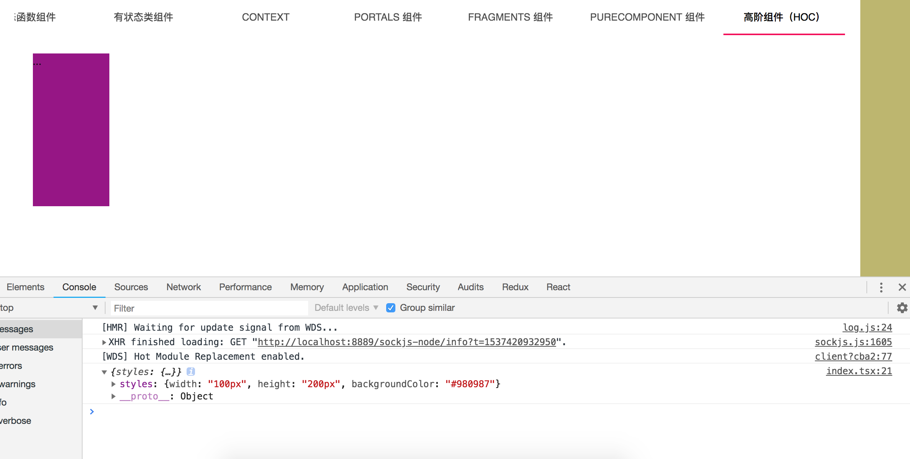

HOC 并不是一个很具体的组件，它仅仅是一个在 `React` 对组件进行重用的设计方法，这种设计方法是由 `React` 自身的设计思想而必然会产生。具体而言，高阶组件就是一个函数，它接收一个组件做为参数，并返回一个组件，这种设计方法的利用，我们可以在很多开源库中看到，如：`redux connect` ，它们都做为一个高阶组件而存在。

那么在 TypeScript 的世界中，我们改如何去写一个高阶组件呢？

举一个例子：



我们设计一个高阶组件，它来接收一个 `styles` 对象，并且传递给你传入的组件，这个 `styles` 对象定义了高宽背景颜色。 首先，我们写一个 `withStyle` 函数，它接收一个 `StyleRules` 类型，并且返回一个范型函数，这个范型函数可以接收任意一个 `React` 组件。

定义 `StyleRules`:

```javascript
interface IStyleRules {
  width?: string;
  height?: string;
  backgroundColor?: string;
}

export type StyleRules = IStyleRules;
```

然后我们定义一个 `AnyComponent`:

```javascript
type AnyComponent<P = any> =
| (new (props: P) => React.Component)
| ((props: P & { children?: React.ReactNode }) => React.ReactElement<any> | null);
```

这个 `AnyComponent` 用于范型函数接收参数的类型。

最后，我们定义一个 `WithStyle` 的函数别名：

```javascript
type WithStyle = (styles: IStyleRules) => <P extends IStylesProps> (Component: AnyComponent<P>) => AnyComponent<P>;
```

当然，这里我也定义了一个 `IStylesProps` 用于简单的范型继承，因为我们会将 `styles` 当 props 传入给传入的组件：

```javascript

export const withStyle: WithStyle = (styles: IStyleRules) => (Component: AnyComponent) => {

  class HOC extends React.Component<{}> {
    public styles: IStyleRules;
    constructor(props: {}) {
      super(props);
      this.styles = styles;
    }
    public render() {
      return <Component styles={this.styles} />;
    }
  }

  return HOC;
};
```

最后，我们该如何使用 `withStyle` 函数呢？

```javascript
import * as React from "react";
import { withStyle, StyleRules, IStylesProps } from "./hoc";

const s: StyleRules = {
  width: "100px",
  height: "200px",
  backgroundColor: "#980987",
};

type IHOCProps = IStylesProps;

class HOCComponent extends React.Component<IHOCProps> {
  constructor(props: IHOCProps) {
    super(props);
  }

  public render() {
    // console.log(this.props);
    return (
      <div style={this.props.styles}>...</div>
    );
  }
}

export default withStyle(s)(HOCComponent);
```

当然我们的这个案例中是一个非常简单的高阶组件，正常情况下，你应该要处理好容器组件中的生命周期，这些会有一些额外的事情。这个案例很好的利用了高阶组件这样的设计方法，完成了它想要的结果。